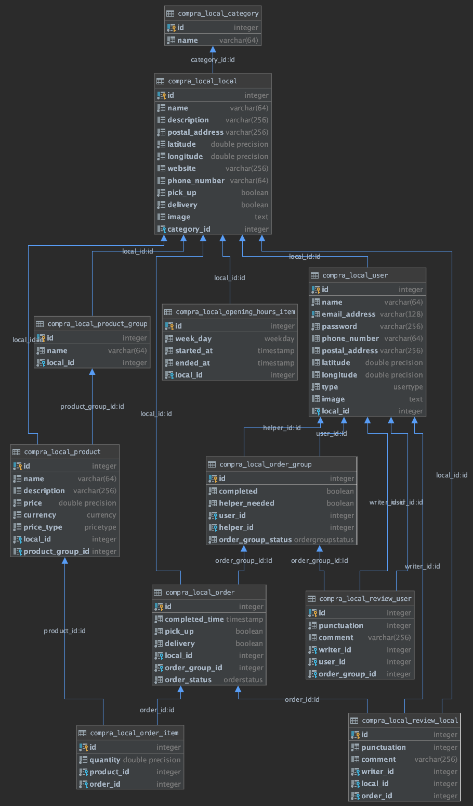

<br>
<p align="center">
  
</p>
<br>

[](http://hits.dwyl.io/carlotacb/compra-local)


[](https://gitHub.com/carlotacb/compra-local/stargazers/)
[](https://gitHub.com/carlotacb/compra-local/network/)
[](https://gitHub.com/carlotacb/compra-local/graphs/contributors/)
[](https://github.com/carlotacb/compra-local/blob/master/LICENSE)

[Demo](https://compralocal.cat) | [Client application](https://app.compralocal.cat) | [Admin application](https://admin.compralocal.cat) | | [API documentation](https://api.compralocal.cat/docs)

🛒 Web application for activating local businesses and making your neighborhood a better place

## Summary

### What is this?

[Compralocal.cat](https://compralocal.cat) és una plataforma de comerç en línia totalment funcional, on els comerços poden llistar els seus productes i els usuaris poden fer comandes a les diferents botigues del barri.

A més, en cas de no poder sortir de casa per qualsevol raó, pots demanar ajuda a la gent del teu voltant perquè et recullin les comandes.

I recorda, queda't a casa, entre tots podem frenar la corva.

### Tech specifications

A nivell d’arquitectura, el Backend està fet en Python, fent servir Flask com a framework, i és una API feta seguint l’standart de OpenAPI. Pel que fa al Frontend hem dissenyat dues aplicacions web en React (pel client i pel local), que serà portable a mòbils a través de una app nativa en futures releases. 

El Frontend està desplegat a Netlifly i el Backend està desplegat a Google Cloud, fent ús del servei de CloudRun,a més d'una base de dades PostgreSQL desplegada a CloudSQL.

Cal destacar que el codi és el màxim production-ready possible i la majoría de funcionalitats disponen de tests. També disposem d'un docker-compose per poder generar un entorn de test en local i fer les proves que siguin necessaries.

Podeu trobar més informació sobre l’arquitectura al README del GitHub.

## Requirements

1. Python 3.7+
2. NodeJS 13.11+
3. docker-ce (as provided by docker package repos)
4. docker-compose (as provided by PyPI)

## Usage

To run the whole stack, please execute the following from the root directory:

1. Run the server as a docker container with docker-compose

    ```bash
    docker-compose up -d --build
    ```

## API

### Recommendations

Usage of [virtualenv](https://realpython.com/blog/python/python-virtual-environments-a-primer/) is recommended for package library / runtime isolation. You should create your virtual environment inside the `api` folder.

### Usage

To run the API, please execute the following commands from the root directory:

1. Change directory to `api`

    ```bash
    cd api/
    ```

2. Setup virtual environment called `env`

    ```bash
    virtualenv -p /path/to/python env
    ```

3. Install dependencies

    ```bash
    pip3 install -r requirements.lock
    ```

4. Set up environment creating the .env file. This file must have this structure (without the brackets):

    ```bash
    DEVELOPMENT_MODE=true
    DB_USER={DB_USER}
    DB_PASSWORD={DB_PASSWORD}
    DB_DB={DB_DB}
    DB_HOST={DB_HOST}
    DB_PORT={DB_PORT}
    ```

5. Run the server using uWSGI

    ```bash
    uwsgi --ini uwsgi.ini -H env
    ```

    or as a Python module (only for debugging)

    ```bash
    python3 -m src.connexion
    ```

### Run tests

1. Just run the following command with the `RUN_MODIFICATIONS` flag enabled

   ```
   RUN_MODIFICATIONS=true python3 -m unittest discover -v
   ```

### Development

#### Logging

For checking the logs of the whole stack in real time, the following command is recommend it:

```bash
docker-compose logs -f
```

#### How to add a new test

Create a new Python file called `test_*.py` in `test.api` with the following structure:

```python
import unittest


class NewTest(unittest.TestCase):

    def test_v0(self):
        expected = 5
        result = 2 + 3
        self.assertEqual(expected, result)

# ...


if __name__ == '__main__':
    unittest.main()

```

### Database

This is the database diagram representing the current Compra Local DB



## Client

### Available Scripts

In the project directory, you can run (from each of the available clients):

```bash
npm start
```

Runs the app in the development mode. Open [http://localhost:3000](http://localhost:3000) to view it in the browser.

The page will reload if you make edits. You will also see any lint errors in the console.

```bash
npm test
```

Launches the test runner in the interactive watch mode. See the section about [running tests](https://facebook.github.io/create-react-app/docs/running-tests) for more information.

```bash
npm run build
```

Builds the app for production to the `build` folder. It correctly bundles React in production mode and optimizes the build for the best performance.

The build is minified and the filenames include the hashes. Your app is ready to be deployed!

See the section about [deployment](https://facebook.github.io/create-react-app/docs/deployment) for more information.

```bash
npm run eject
```

> **Note: this is a one-way operation. Once you `eject`, you can’t go back!**

If you aren’t satisfied with the build tool and configuration choices, you can `eject` at any time. This command will remove the single build dependency from your project.

Instead, it will copy all the configuration files and the transitive dependencies (Webpack, Babel, ESLint, etc) right into your project so you have full control over them. All of the commands except `eject` will still work, but they will point to the copied scripts so you can tweak them. At this point you’re on your own.

You don’t have to ever use `eject`. The curated feature set is suitable for small and middle deployments, and you shouldn’t feel obligated to use this feature. However we understand that this tool wouldn’t be useful if you couldn’t customize it when you are ready for it.

## Authors

- [Elena Ruiz](https://github.com/elena20ruiz)
- [Carlota Catot](https://github.com/carlotacb)
- [Andreu Gallofre](https://github.com/andreugallofre)
- [Albert Suàrez](https://github.com/AlbertSuarez)

## License

Apache-2.0 © Compra Local
